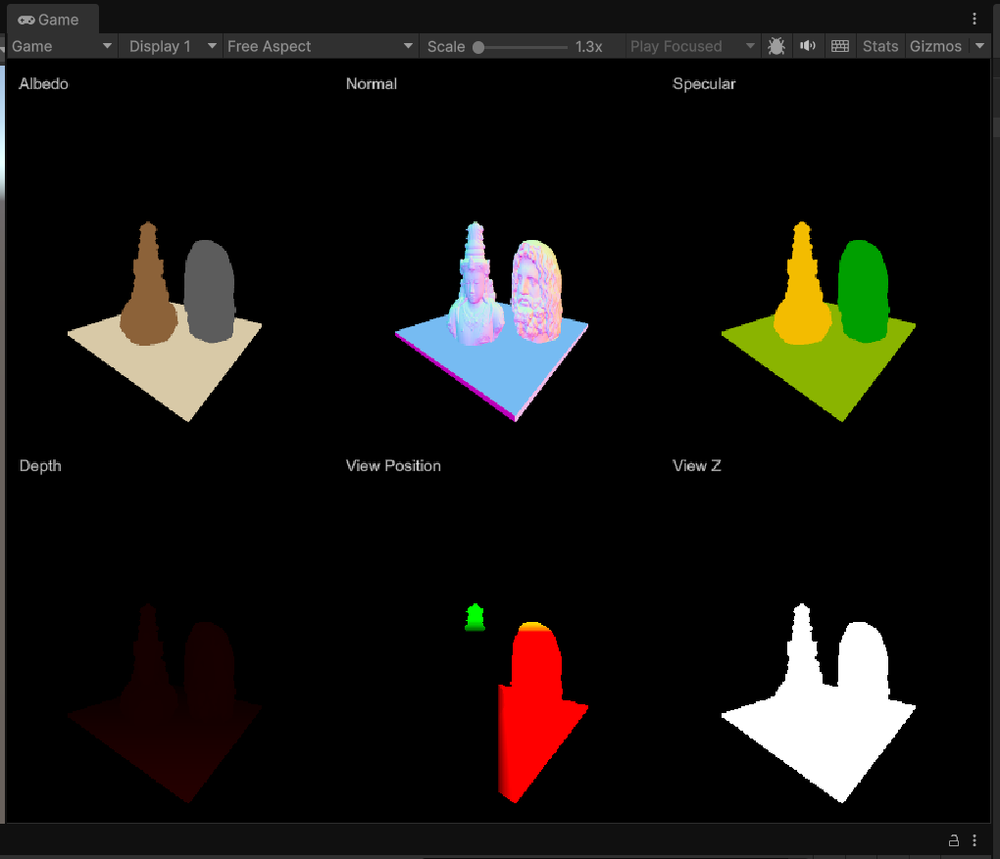
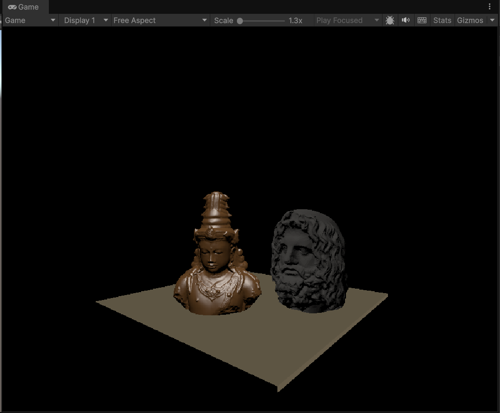
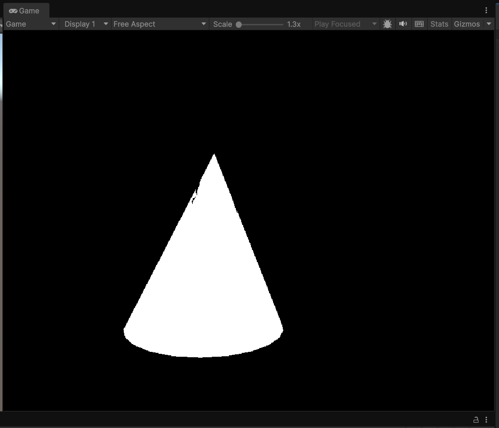
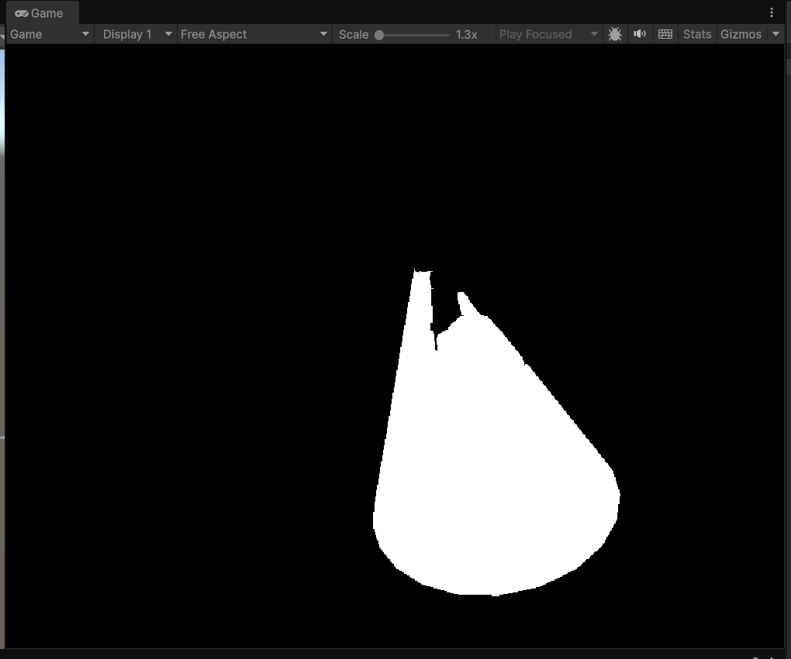
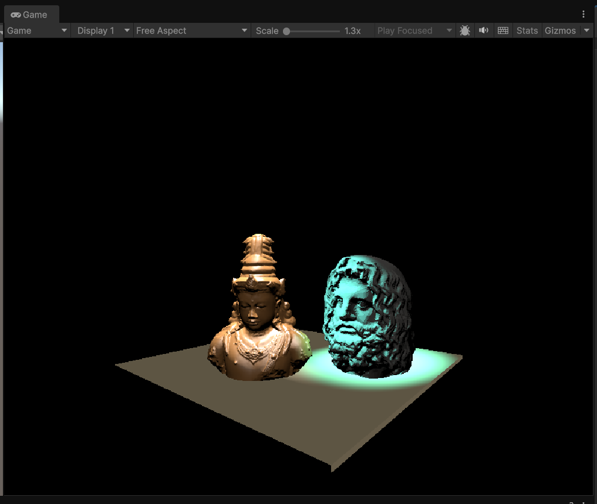

# 🧩 Custom Deferred Rendering in Unity

This project implements a **custom deferred rendering pipeline** from scratch in Unity to explore how deferred shading works under the hood.

---

## 🔹 Overview

- Built a **G-Buffer pass** to capture per-pixel data (Albedo, Normal, Specular, View Position, and Depth).  
- Used a **Directional Light Pass** on G-Buffer data to compute the base lighting.  
- Created **procedural spotlight cones** and rendered per-light intersection masks to identify affected pixels.  
- **Blended** each spotlight’s contribution with the base directional light pass to produce the final image.

---

## 🎨 Rendering Stages

### 🟢 G-Buffer Outputs  
Stores all geometric and material information required for deferred shading.

---

### ☀️ Directional Lighting Pass  
Computes base lighting using view-space data from the G-Buffer.

---

### 🔦 Spotlight Mask Generation  
Each spotlight cone is rendered as a mask to determine which screen pixels are influenced by that light.

  
  

---

### 🌈 Final Blended Output  
Combines the base directional lighting with all spotlight contributions.

---

## 🎥 Demo Video  
🎬 [Watch the full walkthrough on YouTube](https://your-link-here)

This demo explains the pipeline structure — from G-Buffer creation to light blending — and how the shaders and C# scripts connect together.
